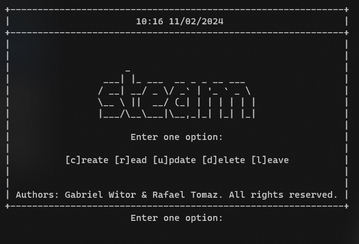

# CRUD-C

This is a simple CRUD system written in C. It has basic capabilities like creating a database and adding, updating and removing elements from the database. All data is stored in a .txt file.

This CRUD system has a "game store theme" and was made as final project for our C programming classes at [UENP](https://uenp.edu.br/).


## Acknowledgements

 - This CRUD system was tested both in Linux and Windows, so it should run properly in both operating systems.
 - This project is under the [MIT license](https://opensource.org/license/mit/).


## How to use

Clone the repository

```bash
git clone https://github.com/gabrielwitor/CRUD-C.git
```

Open the repository folder

```bash
cd CRUD-C
```

Compile the `main.c` file.

```bash
gcc main.c -o main
```

Execute the `main` file.

```bash
.\main
```

You should be prompted with the following screen:




## Authors

- [@gabrielwitor](https://www.github.com/gabrielwitor)
- [@RafaelTomazGraciano](https://github.com/RafaelTomazGraciano)

